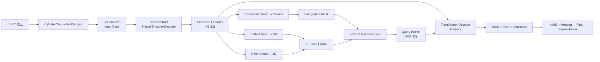

# ForestFormer3D 仓库深度分析

> **论文**: "ForestFormer3D: A Unified Framework for End-to-End Segmentation of Forest LiDAR 3D Point Clouds"
> **会议**: ICCV 2025 Oral | **数据集**: ForAINetV2 | **框架**: 基于 OneFormer3D + MMDetection3D

---

## 1. 项目概览

ForestFormer3D 是一个端到端的森林 LiDAR 3D 点云分割框架，专门用于**单棵树实例分割**。它在 OneFormer3D 的基础上进行了大量定制化改造，以适应大规模林业场景的特殊需求。

### 核心创新点
| 创新 | 描述 |
|------|------|
| **ISA 引导的查询点选择** | 使用 Instance-Semantic Aware 的嵌入+偏移特征，通过 FPS 采样生成查询点 |
| **SE-Gate 自适应融合** | Squeeze-and-Excitation 机制融合嵌入和偏移特征 |
| **两阶段训练** | 前 `prepare_epoch` 轮只训练辅助头，之后加入 Transformer 解码器 |
| **圆柱滑动窗口推理** | 大规模场景通过圆柱区域切片 + 区域合并实现全覆盖推理 |
| **One-to-Many 匹配** | 每个查询可对应最近GT实例，替代传统匈牙利1:1匹配 |
| **Crop-aware IoU** | 处理圆柱裁剪导致的不完整实例，使用 `ratio_inspoint` 修正 IoU |

---

## 2. 架构总览



---

## 3. 核心模块详解

### 3.1 Backbone: SpConvUNet
- **文件**: [spconv_unet.py](file:///home/ubuntu22/projects/ForestFormer3D/oneformer3d/spconv_unet.py)
- **结构**: 递归式 5 级 U-Net，通道数 `[32, 64, 96, 128, 160]`
- **基本块**: [ResidualBlock](file:///home/ubuntu22/projects/ForestFormer3D/oneformer3d/spconv_unet.py#13-92)，每级 2 个残差块（Pre-BN → ReLU → SubMConv3d × 2 + shortcut）
- **下采样**: `SparseConv3d(k=2, s=2)` → **上采样**: `SparseInverseConv3d(k=2)`
- **跳跃连接**: concat 编码器与解码器特征，再通过残差块融合
- 配置 `return_blocks=True` 时返回各级中间特征

### 3.2 Query Point Selection (QPS)
- **文件**: [qps_modules.py](file:///home/ubuntu22/projects/ForestFormer3D/oneformer3d/qps_modules.py), [adaptive_fusion.py](file:///home/ubuntu22/projects/ForestFormer3D/oneformer3d/adaptive_fusion.py)

**流程**:
1. **Embed Head**: `MLP(32→32) → Linear(32→5)` → 5D 嵌入（用于判别性损失）
2. **BiSemantic Head**: `MLP(32→32) → Linear(32→2) → LogSoftmax` → 前景/背景二分类
3. **Offset Head**: `MLP(32→32) → Linear(32→3)` → 3D 质心偏移
4. 用 BiSemantic 预测筛选前景体素（`wood_class == 1`）
5. **SEGateFusion**: L2归一化 → concat → SE通道注意力加权 → 8D融合特征
6. **FPS**: 在融合特征空间做最远点采样，选出 300 个查询点

**4种FPS模式** (`qps_fps_mode`):
- `embed`: 仅用5D嵌入
- [offset](file:///home/ubuntu22/projects/ForestFormer3D/oneformer3d/qps_modules.py#8-39): 仅用3D偏移
- `hybrid`: 直接 concat (8D)
- [se](file:///home/ubuntu22/projects/ForestFormer3D/oneformer3d/oneformer3d.py#4554-4569) ✅: SE-Gate 自适应融合

### 3.3 Transformer Decoder
- **文件**: [query_decoder.py](file:///home/ubuntu22/projects/ForestFormer3D/oneformer3d/query_decoder.py)
- **类**: [ForAINetv2QueryDecoder_XAwarequery](file:///home/ubuntu22/projects/ForestFormer3D/oneformer3d/query_decoder.py#559-784)

**结构**:
- `input_proj`: `Linear(32→256) → LayerNorm → ReLU`
- `x_mask`: `Linear(32→256) → ReLU → Linear(256→256)` (mask特征)
- `query_proj`: `Linear(32→256) → ReLU → Linear(256→256)` (查询投影)
- `semantic_queries`: 3个可学习语义查询嵌入 (Embedding(3, 32))
- 6层解码器，每层: **Cross-Attn → Self-Attn → FFN**
- **迭代预测** (`iter_pred=True`): 每层输出mask→生成attention mask→下层使用

**Prediction Head**:
- `out_norm(queries)` → `out_score`(objectness) + `einsum(query, mask_feat)`(mask logits)
- **注意**: 移除了 `out_cls` 分类头，类别通过语义查询隐式编码

### 3.4 Loss Function
- **文件**: [unified_criterion.py](file:///home/ubuntu22/projects/ForestFormer3D/oneformer3d/unified_criterion.py), [instance_criterion.py](file:///home/ubuntu22/projects/ForestFormer3D/oneformer3d/instance_criterion.py)

| 损失 | 权重 | 说明 |
|------|------|------|
| Discriminative Loss | 1.0 | 嵌入空间拉近/推远实例 |
| Binary Semantic Loss | 1.0 | NLL损失，前景/背景分类 |
| Offset Norm Loss | 0.1 | L1偏移回归 |
| Offset Dir Loss | 0.1 | 偏移方向余弦损失 |
| Mask BCE Loss | 1.0 | 每查询的二值掩码损失 |
| Mask Dice Loss | 0.5 | Dice系数损失 |
| Objectness Score Loss | MSE | 预测分数与 crop-aware IoU 的MSE |
| Semantic Mask Loss | 0.2 | 语义分割 BCE 损失 |

**One-to-Many Matching** ([One2ManyMatcher](file:///home/ubuntu22/projects/ForestFormer3D/oneformer3d/instance_criterion.py#1041-1086)): 使用 `query_masks`（由 `query_inslabel` 构建）建立查询到GT的映射，每个查询标签来自其所在体素的实例ID，允许多个查询对应同一GT。

### 3.5 推理管线
- **文件**: [oneformer3d.py](file:///home/ubuntu22/projects/ForestFormer3D/oneformer3d/oneformer3d.py) L700-846

**大规模场景推理流程**:
1. **圆柱区域生成**: 以 `step_size=radius` 在 XY 平面滑动，生成覆盖全场景的圆柱区域
2. **逐区域推理**: 每个圆柱 → GridSample(0.2m) → PointSample(640K) → 前向推理
3. **掩码收集**: 过滤 score > 0.6 的实例，通过KNN映射回全尺度点云
4. **语义投票**: 每点收集多次预测结果，取众数
5. **实例合并**: [merge_overlapping_instances_by_score](file:///home/ubuntu22/projects/ForestFormer3D/oneformer3d/oneformer3d.py#1670-1729) 基于分数合并重叠实例
6. **后处理**: 去除地面实例、小于10点的实例、重标号

**Blue Points 二轮推理**: 对首轮未分割点重新运行推理，提高密林检测率。

---

## 4. 数据管线

### 数据集: ForAINetV2
- **3类**: `ground`(0), `wood`(1), `leaf`(2)
- **格式**: PLY 点云 → 预处理为 `.bin` (points/instance_mask/semantic_mask)
- **东西/物体划分**: `stuff_classes=[0]`(ground), `thing_cls=[1,2]`(wood, leaf)

### 训练数据增强
```
LoadPointsFromFile → LoadAnnotations3D → CylinderCrop(r=16) 
→ GridSample(0.2m) → PointSample(640K) → SkipEmptyScene 
→ PointInstClassMapping → RandomFlip3D → GlobalRotScaleTrans → Pack
```

### 关键超参数
| 参数 | 值 | 说明 |
|------|-----|------|
| `voxel_size` | 0.2m | 体素化分辨率 |
| `radius` | 16m | 圆柱裁剪半径 |
| `query_point_num` | 300 | 查询点数量 |
| `num_channels` | 32 | backbone通道数 |
| `d_model` | 256 | Transformer隐层维度 |
| `num_heads` | 8 | 注意力头数 |
| `num_layers` | 6 | 解码器层数 |
| `prepare_epoch` | 1000 | 开始训练解码器的轮次 |
| `max_epochs` | 3000 | 总训练轮次 |
| `lr` | 1e-4 | AdamW学习率 |
| `batch_size` | 2 | 训练batch大小 |

---

## 5. 代码文件索引

| 文件 | 行数 | 核心内容 |
|------|------|----------|
| [oneformer3d.py](file:///home/ubuntu22/projects/ForestFormer3D/oneformer3d/oneformer3d.py) | 4980 | 主模型类、推理管线、区域合并 |
| [spconv_unet.py](file:///home/ubuntu22/projects/ForestFormer3D/oneformer3d/spconv_unet.py) | 237 | SpConv U-Net backbone |
| [query_decoder.py](file:///home/ubuntu22/projects/ForestFormer3D/oneformer3d/query_decoder.py) | 1159 | Transformer解码器(3个变体) |
| [instance_criterion.py](file:///home/ubuntu22/projects/ForestFormer3D/oneformer3d/instance_criterion.py) | 1304 | 实例损失+匹配器 |
| [unified_criterion.py](file:///home/ubuntu22/projects/ForestFormer3D/oneformer3d/unified_criterion.py) | 271 | 统一损失(语义+实例) |
| [qps_modules.py](file:///home/ubuntu22/projects/ForestFormer3D/oneformer3d/qps_modules.py) | 75 | 查询点选择器 |
| [adaptive_fusion.py](file:///home/ubuntu22/projects/ForestFormer3D/oneformer3d/adaptive_fusion.py) | 34 | SE-Gate融合模块 |
| [transforms_3d.py](file:///home/ubuntu22/projects/ForestFormer3D/oneformer3d/transforms_3d.py) | ~800 | 数据增强+CylinderCrop |
| [panoptic_losses.py](file:///home/ubuntu22/projects/ForestFormer3D/oneformer3d/panoptic_losses.py) | ~400 | 判别性+偏移损失 |
| [config](file:///home/ubuntu22/projects/ForestFormer3D/configs/oneformer3d_qs_radius16_qp300_2many.py) | 269 | 主配置文件 |

---

## 6. 关键设计决策

1. **去掉分类头**: 森林场景中"tree"类别单一，用语义查询隐式编码类别，避免冗余
2. **两阶段训练**: 前1000 epoch预训练辅助头(embed/semantic/offset)，使查询选择稳定后再训练解码器
3. **Crop-aware IoU**: 圆柱裁剪导致边缘树木不完整，`ratio_inspoint` 修正IoU计算
4. **多轮推理**: 密林中单轮推理会遗漏，"blue points"机制提供补救
5. **One-to-Many匹配**: 允许多查询匹配同一GT，提高对大树的召回率
